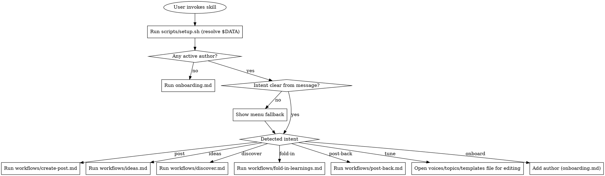

# LinkedIn Posting

A voice-aware LinkedIn drafting system. Captures author voices, topics, and (optionally) post templates as markdown files, then generates publish-ready posts that sound like the actual person — not like an AI content tool.

The killer move is **voice extraction from past posts**. The user pastes 3-5 LinkedIn posts they've written, and the skill infers their tone, vocabulary, sentence rhythm, and hooks. The output is a living `voices/[name].md` file the user can refine over time.

**Domain vocabulary:** see [CONTEXT.md](CONTEXT.md) for the canonical definitions of `author`, `slug`, `canonical voice`, `learnings file`, `passive capture`, `active 1-line check`, `post-back`, `fold-in`, etc. Workflows reference these terms; don't redefine them.

## How this skill is organized

- `voices/` — one markdown file per author. Tone, vocabulary, hooks, things they'd never say. Generated during onboarding, editable by hand.
- `topics/` — one markdown file per content domain the author posts about. Captures interests, message, audience.
- `templates/` — **optional**. Recurring post formats the user adds when they notice patterns (hiring, product update, event recap). Skip this folder entirely if the user only writes freeform.
- `config/people.yaml` — registry of authors. Maps each author to their voice file, topics, and templates.
- `workflows/create-post.md` — turn an idea into a publish-ready post. Auto-routes between a develop-idea dialogue (for vague ideas) and direct drafting (for already-specific ones). Silently captures passive iteration feedback to the author's learnings file; offers a 1-line active check after clipboard delivery.
- `workflows/ideas.md` — generate post ideas for an author from their topics and fresh inspo items.
- `workflows/discover.md` — pull fresh content from the web, seeded by topic files. Picks go to the inspo inbox or straight to drafting. On-demand only.
- `inspo/` — shared inbox of saved content items (`inbox.md`, gitignored; `inbox.example.md` ships). Fuel for anchored ideas and source-backed posts.
- `workflows/fold-in-learnings.md` — promote accumulated learnings into the canonical voice file. User-invoked only.
- `workflows/post-back.md` — read a user's actually-published post against their voice file; proposes a new example and any pattern updates.
- `onboarding.md` — guided first-time setup.

## Where your files live

User content (voices, topics, templates, the author registry, the inspo inbox) lives **outside the skill folder**, in a data directory that updates never touch. The skill folder ships only the program and read-only references.

**At the start of every session, run the setup script first:**

```bash
bash scripts/setup.sh
```

It is idempotent. It resolves the data directory, creates it on first use, migrates any data left in the skill folder by older versions, bootstraps the author registry from the shipped example, and prints the location as its last line: `DATA_DIR=<path>`. Use that path as **`$DATA`** for the rest of the session.

The data directory is `$CLAUDE_PLUGIN_DATA` when that variable is set (Claude Code plugin installs), otherwise `~/.linkedin-post-max`.

**The rule for every path in this skill and its workflows:**

- Paths ending in `_template.md` or `.example.*` are **shipped, read-only**, and live in the **skill folder** (`config/people.example.yaml`, `voices/_template.md`, `topics/_template.md`, `templates/_template.md`, `inspo/inbox.example.md`).
- **Every other** `config/`, `voices/`, `topics/`, `templates/`, and `inspo/` path is **user content** and lives under **`$DATA/`**. So `voices/<slug>.md` means `$DATA/voices/<slug>.md`, `config/people.yaml` means `$DATA/config/people.yaml`, `inspo/inbox.md` means `$DATA/inspo/inbox.md`, and so on.
- Never write into the skill folder. Read templates and examples from it; write everything else to `$DATA/`.

## Routing

When this skill is invoked, decide where to send the user:



**First-run bootstrap.** Always run `bash scripts/setup.sh` first (see "Where your files live"). It creates the data directory if needed, migrates any data left in the skill folder by older versions, and bootstraps `$DATA/config/people.yaml` from the shipped `config/people.example.yaml`. After it runs, check `$DATA/config/people.yaml` for active authors.

**Be explicit about routing.** State out loud what you're doing: "No authors set up yet — let's run onboarding." or "Sending you to create-post." The user should always know where they are.

### Intent detection (worked examples)

The model reads the user message and routes by judgment — no keyword matching, no slash commands required.

| User says | Routes to |
|---|---|
| "Write me a LinkedIn post about X" | `workflows/create-post.md` |
| "Draft a post about X for <author>" | `workflows/create-post.md` |
| "Help me develop an idea: X" | `workflows/create-post.md` (forces develop-idea path) |
| "Just draft: X" | `workflows/create-post.md` (forces direct-draft path) |
| "Brainstorm some ideas for <author>" | `workflows/ideas.md` |
| "Find me some inspo" / "What's popping?" | `workflows/discover.md` |
| "Discover for <topic/author>" / "inspo for <author>" | `workflows/discover.md` |
| "Fold in <author>'s learnings" / "Review <author>'s learnings" | `workflows/fold-in-learnings.md` |
| "Post-back for <author>: <text>" / "I published this for <author>: <text>" | `workflows/post-back.md` |
| "Set up a new author" / "Onboard X" | `onboarding.md` |
| "Tune <author>'s voice" / "Edit <author>'s voice" | Point user at `voices/<slug>.md` directly |
| Vague trigger ("open the linkedin skill") | Menu fallback (see below) |

### Menu fallback

Only when invocation is ambiguous, show this menu:

```
What would you like to do?
  1. Create a post (draft or develop an idea)
  2. Brainstorm ideas for an author
  3. Fold in an author's learnings into their voice file
  4. Post-back a published LinkedIn post for an author
  5. Onboard a new author
  6. Tune an existing voice
  7. Add a new topic or template
  8. Discover fresh content from the web (inspo run)

Pick a number, or just describe what you want.
```

### What this skill does NOT do at runtime

- **No session memory.** Each user message stands alone. Don't assume the author from a previous request — ask if missing.
- **No automatic next-steps offering.** When a task completes, stop. The user re-engages on their terms.

## Rules

1. **Voice overrides template tone.** Template shapes format. Voice shapes language. If they conflict, voice wins.
2. **Never fabricate.** No invented metrics, customers, partners, integrations, features, or quotes. Use `<ASSUMPTION: [what you need]>` placeholders when information is missing.
3. **Never name real people not provided.** Only mention people by name when the user explicitly gives the name.
4. **Auto-detected templates must be confirmed.** If the skill detects a hiring/event/launch pattern, surface it: "This looks like a hiring post — use the hiring template?" Never apply silently.
5. **De-slop every draft before output.** Try the `stop-slop` skill if your agent can invoke other skills. If it isn't available, fall back to the inline checklist in `workflows/create-post.md`.
6. **Always present 2-3 variations** of a draft. Each varies hook, structure, or emphasis. Let the user pick.
7. **No hashtags, no em-dashes, no bold text, no emoji** unless the author's example posts consistently use them.

## File conventions

All user files live under `$DATA/` (see "Where your files live"). Paths below are relative to it.

- Voice file path: `$DATA/voices/<slug>.md` where `<slug>` is the author's first name lowercased.
- Topic file path: `$DATA/topics/<slug>.md` where `<slug>` is a short kebab-case name (e.g., `product`, `company-building`).
- Template file path: `$DATA/templates/<slug>.md` (e.g., `hiring.md`, `product-update.md`).
- In `$DATA/config/people.yaml`: `voice:` uses the path relative to the data dir (`voices/<slug>.md`). `topics:` and `templates:` are bare slugs (`product`, `hiring`).

## Adding new content types

- **New author:** run `onboarding.md`.
- **New topic:** copy `topics/_template.md` → `topics/<slug>.md`, fill it, then add the slug to the relevant authors in `config/people.yaml`.
- **New template:** copy `templates/_template.md` → `templates/<slug>.md`, fill it, then add the slug to the relevant authors in `config/people.yaml`.

## What this skill is NOT

- It is NOT a background monitor. `workflows/discover.md` runs on-demand discovery sweeps, but nothing watches RSS, schedules collection, or tracks trends while you're away.
- It is NOT a scheduler. It produces drafts the user copies into LinkedIn themselves.
- It is NOT a metrics tracker. No analytics, no calendar, no engagement tracking.

Strip these expectations early if the user asks for them — direct them to dedicated tools instead.
